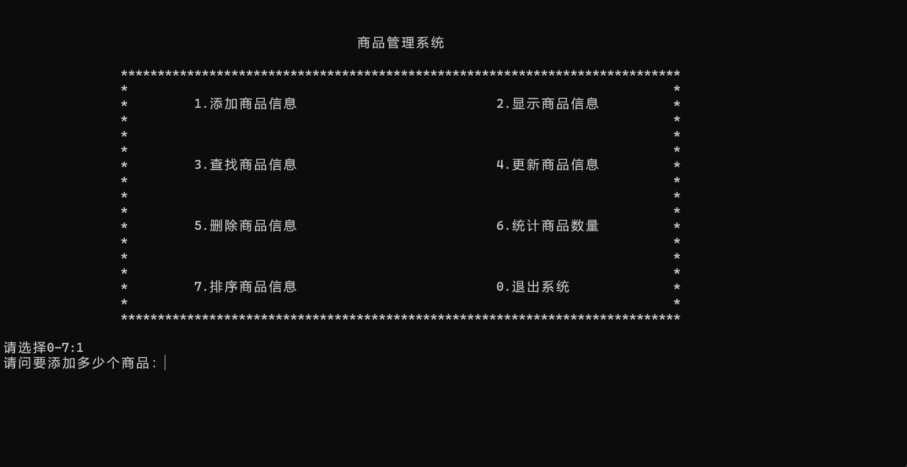
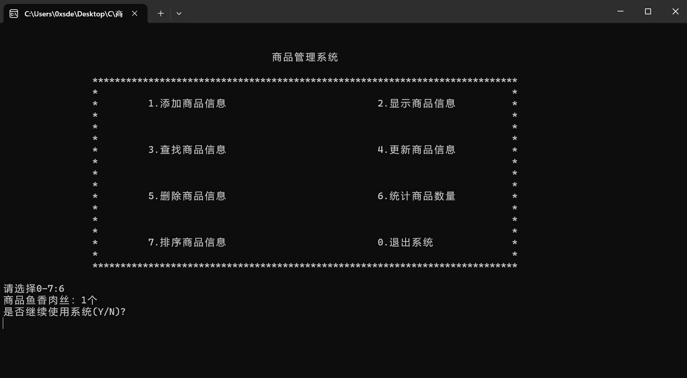

# 商品管理系统 
Author：SpadeA-0

## 功能

1：添加商品信息。
2：显示商品信息
3：查找商品信息
4：更新商品信息
5：删除商品信息
6：统计商品信息
7：排序商品信息
0：退出系统

8：自动将添加的商品信息保存到save.txt里，若目录下不存在save.txt自动生成。

## 特别说明

1. 添加商品信息

要告诉程序录入几个商品：

2. 显示商品信息

显示时采用%0d，例如输入编号1，输出001。

3. 统计商品信息

该功能统计的是库存数量：

库存数量是不能做添加的。

4. 排序商品信息

排序的数组不影响原数组结构。

5. 保存

添加、更新、删除都会自动保存到save.txt中。
